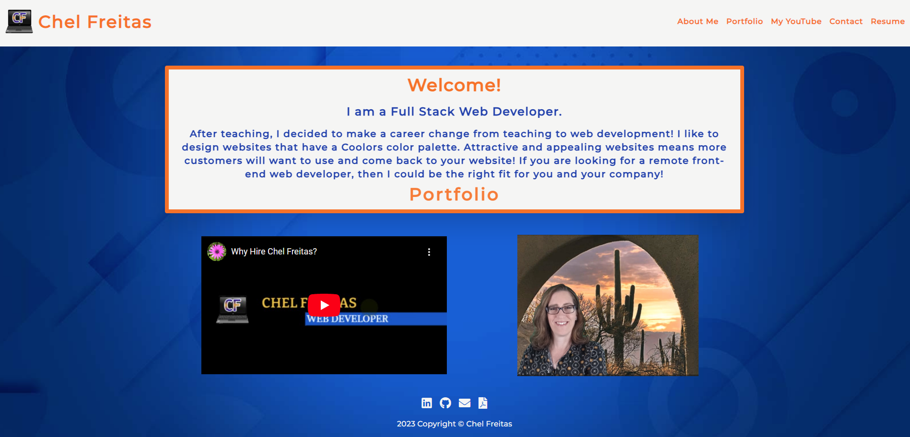

# ⭐ React Portfolio ⭐

## Description ✏️

This is a portfolio application that showcases my work as a web developer.     

## User Story 📖

As a person looking to employ a web developer,
I want to view a potential employee's deployed portfolio of work samples,
so that I can review samples of their work and assess whether they're a good candidate for an open position.

## Table of Contents 📖

- [Link](#link)
- [Screenshot](#badges)
- [How_to_Contribute](#how_to_contribute)
- [Credits_and_Questions](#questions)
- [License](#license)
- [Features](#features)

## Website Link 🔑

You can view this through this link: https://github.com/123sites/React-Portfolio 

This can be used for by anyone looking to hire a web developer.

## Screenshot 🎯

## Credits & Questions 👈

For this Challenge, I utilized code from the 20-React Bootcamp folder and 
I reached-out to get help from a tutor, if I needed help.

## License 📝

The MIT license is in the GitHub repository. Click to link to view it:
[MIT License](https://github.com/123sites/React-Portfolio/blob/main/LICENSE)

## Features ✍

- Coolors color palette
- Created my own logo design
- Polished UI that's responsive
- Video giving 3 good reasons why you should hire me and included music I added and edited.

